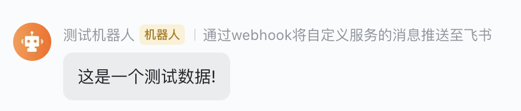
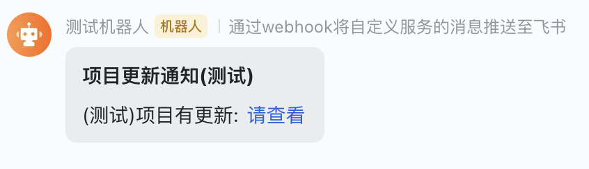
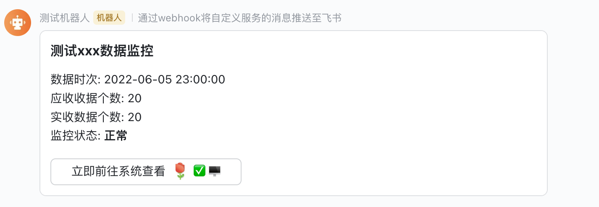

# 飞书通知处理器

> 基于 WebHook 的飞书机器人通知

## 1. 引入依赖

* Maven Central Release

``` xml
<dependency>
   <groupId>club.javafamily</groupId>
   <artifactId>feishu-notification-spring-boot-starter</artifactId>
   <version>2.3.2-beta.9</version>
</dependency>
```

* Maven Central Snapshot

``` xml
   <!-- Snapshot 库需确保 snapshots 是被允许的 -->
   <repositories>
      <repository>
         <id>maven-central</id>
         <url>https://oss.sonatype.org/content/repositories/snapshots</url>
         <releases>
            <enabled>false</enabled>
            <updatePolicy>never</updatePolicy>
         </releases>
         <snapshots>
            <enabled>true</enabled>
            <updatePolicy>always</updatePolicy>
         </snapshots>
      </repository>
   </repositories>

   <dependencies>
      <dependency>
         <groupId>club.javafamily</groupId>
         <artifactId>feishu-notification-spring-boot-starter</artifactId>
         <version>2.3.2-SNAPSHOT</version>
      </dependency>
   </dependencies>
```

## 2. 配置

### 2.1 飞书通知配置

> 创建你自己的飞书 WebHook 机器人, 在 application.yml 中配置飞书通知的 webhook 地址

```yml
javafamily:
   notify:
      feishu:
         hook-url: https://open.feishu.cn/open-apis/bot/v2/hook/09973b31-0c1a-4924-b900-6173bb429644
         enabled: true  # 是否开启通知, 用于不同环境下的区分(开发, 测试, 生产), 默认为 true
```

### 2.2 restTemplate 配置

> 发送 webhook 请求底层是通过封装的 `resttemplate` 进行请求,
> 而 `restTemplate` 是通过 [javafamily-resttemplate-starter](https://github.com/JavaFamilyClub/javafamily-core/tree/main/javafamily-resttemplate-starter)
> 提供组件服务与配置, 因此, `feishu-notification-spring-boot-starter` 天生支持 `javafamily-resttemplate-starter` 组件的全部配置.
>
> 如: 配置代理(支持 http 及 socks 代理)

``` yml
javafamily:
   notify:
      feishu:
         hook-url: http://open.feishu.cn/open-apis/bot/v2/hook/09973b31-0c1a-4924-b900-6173bb429644

   http:
      proxy:
         type: http # type: socks
         host: 192.168.56.27
         port: 10080
```

> 更多 `restTemplate` 的配置请参考: [javafamily-resttemplate-starter](https://github.com/JavaFamilyClub/javafamily-core/tree/main/javafamily-resttemplate-starter)

## 3. 注入 `FeiShuNotifyHandler`

``` java
@SpringBootTest
public class FeiShuNotifyTests {

   @Autowired
   private FeiShuNotifyHandler feiShuNotifyHandler;
```

## 4. 创建 Request, 发送通知

* Text 通知
```java
   @Test
   void testNotifyText() {
      final String response = feiShuNotifyHandler.notify(
         FeiShuTextNotifyRequest.of("这是一个测试数据!"));

      log.info(response);
   }
```



* Post 通知
```java
   @Test
   void testNotifyPost() {
      final FeiShuPostNotifyRequest request = FeiShuPostNotifyRequest.of(
         "项目更新通知(测试)",
         new BaseTextTagContentItem("(测试)项目有更新: "),
         new LinkTagContentItem("请查看",
            "https://github.com/orgs/JavaFamilyClub/projects/3"));

      final String response = feiShuNotifyHandler.notify(request);

      log.info(response);
   }
```



* Card 通知

``` java
   @Test
   void testNotifyCard() {
      String dataTime = "2022-06-05 23:00:00";
      int shouldCount = 20, actualCount = 20;
      String status = actualCount < shouldCount ? "异常" : "正常";

      String content = "数据时次: " + dataTime
         + "\n应收收据个数: " + shouldCount
         + "\n实收数据个数: " + actualCount
         + "\n监控状态: **" + status + "**";

      final FeiShuCardNotifyRequest request
         = FeiShuCardNotifyRequest.of("测试xxx数据监控", content,
         "立即前往系统查看 :玫瑰:️ ✅ \uD83D\uDDA5️",
         "https://github.com/orgs/JavaFamilyClub/projects/3");

      final String response = feiShuNotifyHandler.notify(request);

      log.info(response);
   }
```


