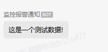
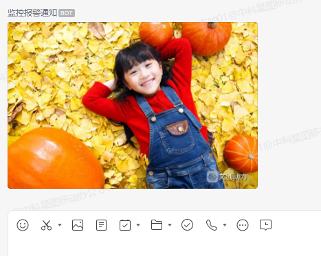
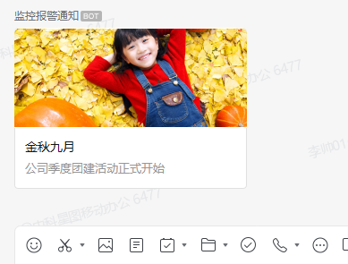
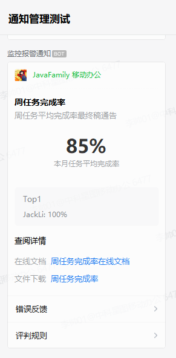
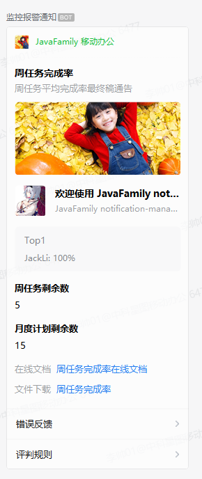

# 企业微信通知处理器

> 基于 WebHook 的企业微信机器人通知

## 1. 引入依赖

* Maven Central Release (Maven 中央仓库正式版)

``` xml
<dependency>
   <groupId>club.javafamily</groupId>
   <artifactId>qywechat-notification-spring-boot-starter</artifactId>
   <version>2.3.2-beta.14</version>
</dependency>
```

* Maven Central Snapshot (Maven SNAPSHOT 仓库新功能尝鲜)

``` xml
   <!-- Snapshot 库需确保 snapshots 是被允许的 -->
   <repositories>
      <repository>
         <id>maven-central</id>
         <url>https://oss.sonatype.org/content/repositories/snapshots</url>
         <releases>
            <enabled>false</enabled>
            <updatePolicy>never</updatePolicy>
         </releases>
         <snapshots>
            <enabled>true</enabled>
            <updatePolicy>always</updatePolicy>
         </snapshots>
      </repository>
   </repositories>

   <dependencies>
      <dependency>
         <groupId>club.javafamily</groupId>
         <artifactId>qywechat-notification-spring-boot-starter</artifactId>
         <version>2.3.2-SNAPSHOT</version>
      </dependency>
   </dependencies>
```

## 2. 配置

### 2.1 企业微信通知配置

> 创建你自己的企业微信 WebHook 机器人, 在 application.yml 中配置企业微信通知的 webhook 地址

```yml
javafamily:
   notify:
      qywechat:
         hook-url: https://open.qywechat.cn/open-apis/bot/v2/hook/09973b31-0c1a-4924-b900-6173bb429644
         enabled: true  # 是否开启通知, 用于不同环境下的区分(开发, 测试, 生产), 默认为 true
```

### 2.2 抑制策略

> 当我们需要对通知进行抑制时(如: 通过企业微信通知一些接口异常、服务宕机等信息, 有时候并不需要一直推送通知消息), 此时, 就可以通过抑制策略进行通知消息的抑制!

```yml
javafamily:
   notify:
      qywechat:
         hook-url: https://qyapi.weixin.qq.com/cgi-bin/webhook/send?key=d7ad561e-196c-4dad-bbda-06bd681db50f
         inhibit:
            enabled: on # 默认为 off
            ttl: 1h # 代表同一个消息, 1h 只推送一次
```

> 通过指定 `inhibit` 属性进行抑制配置, 目前支持的属性有:
> * `enabled`: 是否开启抑制
> * `ttl`: 抑制时效(同样的通知多久发送一次)

> 通知抑制是通过 [javafamily-cache 组件](https://github.com/JavaFamilyClub/javafamily-cache) 提供组件服务与配置, 因此,
> `qywechat-notification-spring-boot-starter` 同样支持 `JavaFamilyClub/javafamily-cache` 组件的全部配置.
> 如:

```yml
javafamily:
  notify:
    qywechat:
      hook-url: https://qyapi.weixin.qq.com/cgi-bin/webhook/send?key=d7ad561e-196c-4dad-bbda-06bd681db50f
      inhibit:
        enabled: on
        ttl: 3s

  cache:
    type: caffeine # redis
    key-prefix: demo- # 缓存 key 前缀
    time-to-live: 20s # 缓存 expire 时间
    caffeine: # caffeine 缓存相关配置
      max-size: 500
      weak-keys: on
      soft-values: on
      record-stats: on
```

> 需要注意, `cache.time-to-live` 与 `inhibit.ttl` 如果都配置, 则 `inhibit.ttl` 优先级更高(生效).

> 更多配置请查看 [JavaFamilyClub/javafamily-cache](https://github.com/JavaFamilyClub/javafamily-cache)

### 2.3 restTemplate 配置

> 发送 webhook 请求底层是通过封装的 `resttemplate` 进行请求,
> 而 `restTemplate` 是通过 [javafamily-resttemplate-starter](https://github.com/JavaFamilyClub/javafamily-core/tree/main/javafamily-resttemplate-starter)
> 提供组件服务与配置, 因此, `qywechat-notification-spring-boot-starter` 天生支持 `javafamily-resttemplate-starter` 组件的全部配置.
>
> 如: 配置代理(支持 http 及 socks 代理)

``` yml
javafamily:
   notify:
      qywechat:
         hook-url: http://open.qywechat.cn/open-apis/bot/v2/hook/09973b31-0c1a-4924-b900-6173bb429644

   http:
      proxy:
         type: http # type: socks
         host: 192.168.56.27
         port: 10080
```

> 更多 `restTemplate` 的配置请参考: [javafamily-resttemplate-starter](https://github.com/JavaFamilyClub/javafamily-core/tree/main/javafamily-resttemplate-starter)

## 3. 注入 `QyWechatNotifyHandler`

``` java
@Slf4j
@SpringBootTest
public class QyWechatNotifyTests {

   @Autowired
   private QyWechatNotifyHandler qywechatNotifyHandler;
```

## 4. 创建 Request, 发送通知

* 文本类型 通知

```java
@Test
void testNotifyText() {
    final String response = qywechatNotifyHandler.notify(
    QyWechatTextNotifyRequest.of("这是一个测试数据!"));

    log.info(response);
}
```



* markdown类型 通知

```java
   @Test
   void testNotifyMarkDown() {
      String dataTime = "2022-06-05 23:00:00";
      int shouldCount = 20, actualCount = 20;
      String status = actualCount < shouldCount ? "异常" : "正常";

      String content = "@18829346477 数据时次: " + dataTime
              + "\n应收收据个数: " + shouldCount
              + "\n实收数据个数: " + actualCount
              + "\n监控状态: **" + status + "**";

      QyWechatMarkdownNotifyRequest request = QyWechatMarkdownNotifyRequest.of(content);

      final String response = qywechatNotifyHandler.notify(request);

      log.info(response);
   }
```


* 图片类型通知

```java
   @Test
   void testNotifyImage() throws Exception {
      String imagePath = "C:\\Temp\\test.jpg";

      Path path = Paths.get(imagePath);

      byte[] byteArray = Files.readAllBytes(path);
      QyWechatImageNotifyRequest request = QyWechatImageNotifyRequest.of(byteArray);

      final String response = qywechatNotifyHandler.notify(request);

      log.info(response);
   }
```




* 图文类型

``` java
   @Test
   void testNotifyNews() throws Exception {
      QyWechatNewsNotifyRequest request = QyWechatNewsNotifyRequest.of(
              "金秋九月", "公司季度团建活动正式开始",
              "https://github.com/JavaFamilyClub/notification-manager",
              "https://t7.baidu.com/it/u=2204205512,3039153138&fm=193&f=GIF");

      final String response = qywechatNotifyHandler.notify(request);

      log.info(response);
   }
```




* 文件类型 消息

// TODO


* 语音类型 消息

// TODO


* 文本通知模版卡片 消息

```java
   @Test
   void testTextNotifyCard() {
      QyWechatCardRequestContent requestContent = new QyWechatCardRequestContent();

      requestContent.setSource(QyWechatCardRequestContentSource.builder()
              .icon_url("https://t7.baidu.com/it/u=2204205512,3039153138&fm=193&f=GIF")
              .desc("JavaFamily 移动办公")
              .desc_color(3)
              .build());

      requestContent.setMain_title(TitleDescContent.of("周任务完成率", "周任务平均完成率最终稿通告"));
      requestContent.setEmphasis_content(TitleDescContent.of("85%", "本月任务平均完成率"));

      requestContent.setQuote_area(QyWechatCardRequestContentQuoteArea.builder()
              .type(0)
              .title("Top1")
              .quote_text("JackLi: 100%")
              .build());

      requestContent.setSub_title_text("查阅详情");
      requestContent.setHorizontal_content_list(Arrays.asList(
              QyWechatCardRequestContentHorizontal.builder()
                      .type(1)
                      .keyname("在线文档")
                      .value("周任务完成率在线文档")
                      .url("https://t7.baidu.com/it/u=2204205512,3039153138&fm=193&f=GIF")
                      .build(),
              QyWechatCardRequestContentHorizontal.builder()
                      .type(2)
                      .keyname("文件下载")
                      .value("周任务完成率")
                      .media_id("3JsHtiugcvnuMVGIvjGMT4I5TihgRFZZRazoD5CR52P3ASvpf2IqpG6bsCV2NPi1m")
                      .build()));

      requestContent.setJump_list(Arrays.asList(QyWechatCardRequestContentJump.builder()
                      .type(1)
                      .title("错误反馈")
                      .url("https://github.com/JavaFamilyClub/notification-manager")
                      .build(),
              QyWechatCardRequestContentJump.builder()
                      .type(0)
                      .title("评判规则")
                      .build()));

      requestContent.setCard_action(QyWechatCardRequestContentCardAction.builder()
              .type(1)
              .url("https://github.com/JavaFamilyClub/notification-manager")
              .build());

      QyWechatCardNotifyRequest request = new QyWechatCardNotifyRequest(requestContent);

      String response = qywechatNotifyHandler.notify(request);

      log.info(response);
   }
```





* #### 图文展示模版卡片 消息

``` java
   @Test
   void testNotifyImageTextCard() {
      QyWechatCardRequestNewsContent requestContent = new QyWechatCardRequestNewsContent();

      requestContent.setSource(QyWechatCardRequestContentSource.builder()
              .icon_url("https://t7.baidu.com/it/u=2204205512,3039153138&fm=193&f=GIF")
              .desc("JavaFamily 移动办公")
              .desc_color(3)
              .build());

      requestContent.setMain_title(TitleDescContent.of("周任务完成率", "周任务平均完成率最终稿通告"));

      requestContent.setCard_image(QyWechatCardRequestContentCardImage.builder()
              .url("https://t7.baidu.com/it/u=2204205512,3039153138&fm=193&f=GIF")
              .aspect_ratio(2.25F)
              .build());

      requestContent.setImage_text_area(QyWechatCardRequestContentImageTextArea.builder()
              .type(1)
              .url("https://github.com/JavaFamilyClub/notification-manager")
              .image_url("https://hbimg.huabanimg.com/e51c5ec5a5b1e43128662531ea49732dbf1331991fe56-WQTUEo_fw658")
              .title("欢迎使用 JavaFamily notification-manager")
              .desc("JavaFamily notification-manager 是一个用于推送各类平台消息的 SDK")
              .build());

      requestContent.setQuote_area(QyWechatCardRequestContentQuoteArea.builder()
              .type(0)
              .title("Top1")
              .quote_text("JackLi: 100%")
              .build());

      requestContent.setVertical_content_list(Arrays.asList(
              TitleDescContent.of("周任务剩余数", "5"),
              TitleDescContent.of("月度计划剩余数", "15")));

      requestContent.setHorizontal_content_list(Arrays.asList(
              QyWechatCardRequestContentHorizontal.builder()
                      .type(1)
                      .keyname("在线文档")
                      .value("周任务完成率在线文档")
                      .url("https://t7.baidu.com/it/u=2204205512,3039153138&fm=193&f=GIF")
                      .build(),
              QyWechatCardRequestContentHorizontal.builder()
                      .type(2)
                      .keyname("文件下载")
                      .value("周任务完成率")
                      .media_id("3JsHtiugcvnuMVGIvjGMT4I5TihgRFZZRazoD5CR52P3ASvpf2IqpG6bsCV2NPi1m")
                      .build()));

      requestContent.setJump_list(Arrays.asList(QyWechatCardRequestContentJump.builder()
                      .type(1)
                      .title("错误反馈")
                      .url("https://github.com/JavaFamilyClub/notification-manager")
                      .build(),
              QyWechatCardRequestContentJump.builder()
                      .type(0)
                      .title("评判规则")
                      .build()));

      requestContent.setCard_action(QyWechatCardRequestContentCardAction.builder()
              .type(1)
              .url("https://github.com/JavaFamilyClub/notification-manager")
              .build());

      QyWechatCardNotifyRequest request = new QyWechatCardNotifyRequest(requestContent);

      String response = qywechatNotifyHandler.notify(request);

      log.info(response);
   }
```





## 5. 示例代码

> 所有的示例代码都在 [examples](./examples)

* `组件使用示例`: [组件使用示例项目](./examples/demo-notification-manager)
* `抑制通知示例`: [抑制配置示例项目](./examples/demo-notification-manager-inhibit)
